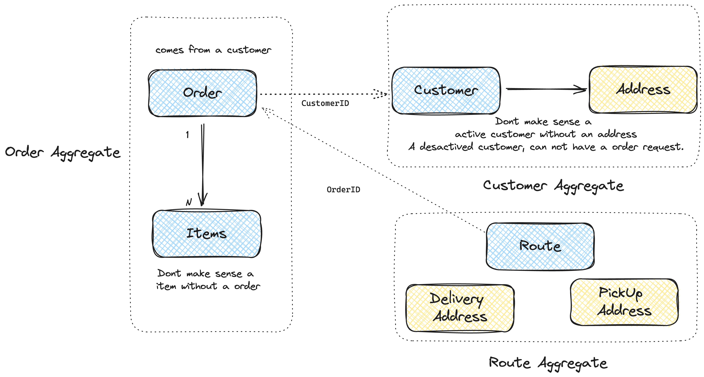

# DDD Effective

### Entities

An entity should be unique, that can be changed continuously for a long time. - 'Vernon Vaughn.'

An entity should have the data consistency, auto validation principle.

An entity should have an auto validation, if this responsibility is in other objects, is a danger because a entity can have inconsistent data.

### Value Objects

When you have only attributes in an element of the model, this element is a value object.
A value object is immutable, and should be used in entities. 
In other words, the values of a VO should not be changed, but the VO is replaced completely.

Rules for Value Objects:
- Immutability
- Auto validation
- Not have an identity (id) because it is a group of attributes.

### Aggregates

An aggregate is a group of entities and value objects that are treated as a single unit.

